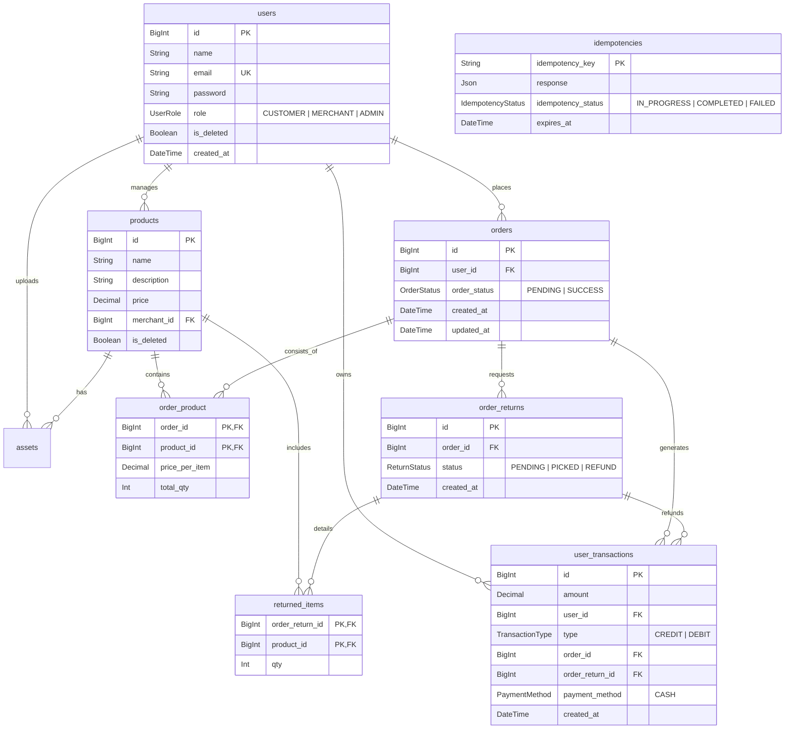

<p align="center">
  
</p>

<h1 align="center">Simple Shop API</h1>

<p align="center">
  <b>A Scalable, Enterprise-Grade E-Commerce & Financial Ledger Backend</b>
</p>

<p align="center">
  
  
  
  
  
  
</p>

---

## 📌 Overview

**Simple Shop API** is a production-ready Node.js backend built with **NestJS 11**, **Prisma ORM**, and **MySQL**. It models an e-commerce ecosystem featuring multi-role authentication, product catalog management, payment transactions ledger, return requests, and cloud media management with built-in idempotency protection.

---

## ⚡ Key Architectural Features

- 🔐 **Role-Based Access Control (RBAC)**: Custom metadata decorators (`@Roles`) guarding endpoints across `CUSTOMER`, `MERCHANT`, and `ADMIN` roles.
- 🔁 **Idempotency Engine**: Header-driven (`idempotency-key`) interceptor backed by MySQL persistence to ensure safe, duplicate-free order placements and return requests.
- 💳 **Financial Ledger & Returns**: Double-entry transaction model (`CREDIT` / `DEBIT`) tracking order purchases, returns, and inventory quantity synchronization.
- 🖼️ **Cloud Asset Management**: Integrated **ImageKit CDN** provider with an automated `FileCleanupInterceptor` that removes temporary disk files after cloud upload.
- 🛡️ **Global Resiliency & Filtering**: Centralized exception pipeline with dedicated filters (`PrismaExceptionFilter`, `ZodExceptionFilter`, `HttpExceptionFilter`, `ImageKitExceptionFilter`).
- ⏱️ **Rate Limiting**: Configured with `@nestjs/throttler` to prevent abuse on sensitive authentication and transaction routes.
- 📖 **Interactive Swagger Documentation**: Full OpenAPI specs hosted at `/api/docs` with request models, authorization schemas, and response types.

---

## 🗄️ Database Architecture (ERD)



---

## 🚀 Interactive API Documentation

Interactive Swagger API documentation is served out-of-the-box:

- **Swagger UI**: `http://localhost:3000/api/docs`

> You can authenticate directly within Swagger UI using the `Authorize` button and passing your JWT Bearer token!

---

## 🛠️ API Reference Table

| Category | Method | Endpoint | Access Role | Description |
| :--- | :---: | :--- | :---: | :--- |
| **Auth** | `POST` | `/api/auth/register` | Public | Register a new user account (`CUSTOMER`, `MERCHANT`, `ADMIN`) |
| **Auth** | `POST` | `/api/auth/login` | Public | Authenticate user & issue JWT token |
| **Auth** | `GET` | `/api/auth/validate` | Authenticated | Validate active JWT session token |
| **Products** | `POST` | `/api/product` | `MERCHANT` | Create product with image asset upload (Idempotent) |
| **Products** | `GET` | `/api/product` | `CUSTOMER`, `MERCHANT` | List products with pagination & search |
| **Products** | `GET` | `/api/product/:id` | `CUSTOMER`, `MERCHANT` | Get product details by ID |
| **Products** | `PATCH` | `/api/product/:id` | `MERCHANT` | Update product details or image asset |
| **Products** | `DELETE` | `/api/product/:id` | `MERCHANT` | Soft-delete a product |
| **Orders** | `POST` | `/api/order` | `CUSTOMER`, `ADMIN` | Place new purchase order (Idempotent) |
| **Orders** | `GET` | `/api/order` | `CUSTOMER`, `ADMIN` | View authenticated user order history |
| **Orders** | `GET` | `/api/order/:id` | `CUSTOMER`, `ADMIN` | Get order breakdown by ID |
| **Orders** | `POST` | `/api/order/:id/status` | `ADMIN` | Update order status (`PENDING` -> `SUCCESS`) |
| **Returns** | `POST` | `/api/order/return` | `CUSTOMER`, `ADMIN` | Request order item return/refund (Idempotent) |
| **Returns** | `POST` | `/api/order/return/:id/status` | `ADMIN` | Update return status & trigger inventory refund |
| **Ledger** | `GET` | `/api/transactions` | Authenticated | Query personal credit/debit transaction history |
| **Users** | `GET` | `/api/user` | Authenticated | List registered users with pagination |
| **Users** | `PATCH` | `/api/user/:id` | Authenticated | Update user profile information |

---

## 💻 Local Setup & Development Guide

### Prerequisites
- Node.js `20.x` or higher
- MySQL `8.0` or Docker Desktop

### 1. Clone & Install Dependencies
```bash
git clone https://github.com/your-username/simple-shop.git
cd simple-shop
npm install
```

### 2. Configure Environment Variables
Copy the template `.env.example` file to `.env`:
```bash
cp .env.example .env
```

### 3. Run via Docker Compose (Recommended)
Launch the MySQL database and application containers instantly:
```bash
docker-compose up -d
```

### 4. Alternative: Run Locally with Prisma
```bash
# Push schema to MySQL database
npx prisma db push

# (Optional) Seed initial data
npm run seed

# Start NestJS development server
npm run dev
```

The application will start on **`http://localhost:3000`** with Swagger documentation available at **`http://localhost:3000/api/docs`**.

---

## 🧪 Testing

```bash
# Run unit tests
npm run test

# Run end-to-end integration tests
npm run test:e2e

# Generate test coverage report
npm run test:cov
```

---

## 📜 License

This project is open-source and available under the [MIT License](LICENSE).
